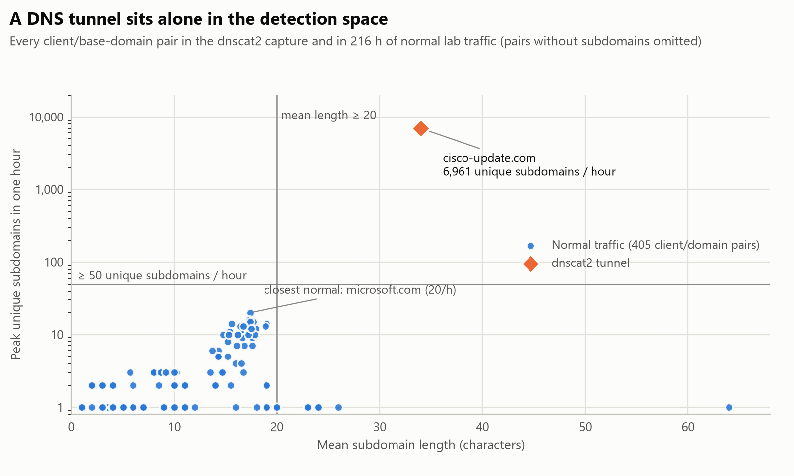

# Case 01 — DNS tunnelling: a 24-hour covert channel that 52,985 signatures missed

| | |
|---|---|
| **Dataset** | Active Countermeasures, [*Malware of the Day — dnscat2 DNS Tunneling*](https://www.activecountermeasures.com/malware-of-the-day-dnscat2-dns-tunneling/): 24-hour lab capture (82.6 MB), plus 9 × 24 h of normal lab traffic from the same source for false-positive testing |
| **Scenario** | Ubuntu host `10.20.57.3` runs a dnscat2 client; its C2 domain is `cisco-update[.]com` |
| **Question** | Is any host using DNS as a covert channel, and could we have caught it without a signature? |
| **Verdict** | **Confirmed DNS tunnel** — 165,517 encoded queries in 24 h through the internal resolvers |
| **MITRE ATT&CK** | T1071.004 Application Layer Protocol: DNS · T1572 Protocol Tunneling · T1041 Exfiltration Over C2 Channel · T1583.001 Acquire Infrastructure: Domains |
| **Tools** | Zeek 9.0.0 · Suricata 8.0.6 with ET Open (68,941 rules, 52,985 enabled, 2026-09-25) · Python |
| **Detections produced** | [`dns_profile.py`](../../tools/dns_profile.py) (hunt) · [`dns-tunnel-detect.zeek`](../../detections/zeek/dns-tunnel-detect.zeek) (real time) · [`dns-tunnel.rules`](../../detections/suricata/dns-tunnel.rules) (IDS) · [`dns-tunnel-hunting.kql`](../../detections/kql/dns-tunnel-hunting.kql) (Sentinel / Defender XDR) |

## Summary

- **ET Open raised 2,538 alerts in 24 hours and none of them was about the tunnel.** They were capture artefacts
  (invalid checksums, unknown ethertypes) and package-manager traffic.
- **The tunnel is obvious once you look at behaviour instead of signatures.** One client asked for 165,378
  *different* names under one domain, up to 6,961 per hour. Every name was 34 hexadecimal characters. The busiest
  normal domain in 216 hours of lab traffic peaked at 20 unique names per hour.
- **Three detections, one logic, pre-registered thresholds.** A Python hunt, a Zeek script and a Suricata rule all
  flag it: **Zeek within 27 seconds** of the tunnel starting, Suricata within 69 seconds, one alert per hour
  instead of thousands.
- **Zero false positives** on 216 hours of normal traffic (522 client/domain pairs) for the hunt, and on a
  24-hour normal capture for the Zeek script and the Suricata rule.
- **Blocking the C2 IP would not have worked.** The host never contacted it directly: every query went through
  the two internal resolvers, so containment has to happen at the DNS layer.

## 1. What the defender can see

DNS is allowed out of almost every network, and a host normally sends its queries to the organisation's own
resolvers. For the defender this has two consequences:

- the suspicious host **never talks to the attacker directly**, so IP blocklists and "connection to a bad IP" alerts
  see nothing;
- everything that matters is in the **query names** the resolvers handle, which is exactly what Zeek's `dns.log`
  records.

Tunnelled traffic has a recognisable **shape** in those logs, very different from normal lookups:

| | Normal lookups | Tunnel (this capture) |
|---|---|---|
| Distinct names per domain | A handful, reused all day | A new name for almost every query |
| Length of the leftmost labels | Short words (`www`, `login`, `update`) | Long encoded strings (34 characters) |
| Character distribution | Readable words | Hexadecimal, high entropy |

The detections in this case are built on those three properties.

## 2. Evidence

### 2.1 Signature baseline: what ET Open saw

Suricata replayed the 24-hour capture with the full ET Open ruleset:

| Alerts (24 h) | Signature | Related to the tunnel? |
|---:|---|---|
| 2,319 | SURICATA TCPv4 invalid checksum | No: checksum offloading on the capturing host |
| 155 | ET INFO GNU/Linux APT User-Agent Outbound likely related to package management | No: `apt` updates |
| 60 | SURICATA Ethertype unknown | No: capture artefact |
| 4 | SURICATA Applayer Mismatch protocol both directions | No |
| **0** | *anything about dnscat2, DNS tunnelling or cisco-update.com* | — |

Signatures match known byte patterns. This tunnel uses a new domain, encoded payloads and ordinary query types,
so there is no fixed pattern to match. (The checksum alerts come from packets captured on the sending host, whose
network card computes checksums after the capture point.)

### 2.2 Zeek: DNS behaviour per client and base domain

Zeek turned the capture's 363,735 packets into a `dns.log` with one line per query. Grouping it by client and
registrable domain ([`dns_profile.py`](../../tools/dns_profile.py)) gives 13 pairs. The top of the table:

| Client | Base domain | Queries | Unique subdomains | Peak unique / hour | Mean length | Entropy (bits/char) | Hex-only |
|---|---|---:|---:|---:|---:|---:|---:|
| 10.20.57.3 | **cisco-update.com** | **165,517** | **165,378** | **6,961** | **34.0** | **3.63** | **100 %** |
| 10.20.57.3 | opensuse.org | 80 | 7 | 7 | 17.6 | 3.17 | 0 % |
| 10.20.57.3 | ubuntu.com | 1,134 | 4 | 4 | 16.5 | 3.25 | 0 % |
| 10.20.57.3 | rhodes.edu | 6,816 | 2 | 2 | 15.5 | 2.29 | 50 % |

The tunnel's profile:

| Property | Value | Why it matters |
|---|---|---|
| Duration | 2021-06-09 04:28:44 → 2021-06-10 04:28:44 UTC | Active for the whole capture, not a one-off burst |
| Rhythm | One query every 0.51 s (median); 3,313 to 6,965 per hour | Polling: the client asks for work even when idle |
| Query types | MX 55,359 · CNAME 55,080 · TXT 55,073 | An even three-way split of record types for one domain is itself unusual |
| Name shape | 34 hex characters + `.cisco-update.com`: 165,515 of the 165,517 queries are exactly 51 characters long | Fixed-size encoded frames |
| Response codes | NOERROR 165,401 · SERVFAIL 1 · none 115 | The authoritative server answers everything: it is a real, attacker-run zone |
| Domain | `cisco-update[.]com` | Brand look-alike chosen to blend in with update traffic |

`rhodes.edu` is a useful contrast: 6,816 queries, but only **2** distinct names (an Ubuntu mirror looked up over
and over). Volume alone is not the signal; **uniqueness** is.

### 2.3 Path: the host never talks to the attacker

| Resolver | Queries |
|---|---:|
| 10.10.2.22 : 53/udp | 95,166 |
| 10.10.2.21 : 53/udp | 70,351 |
| **157.230.93.100** (the C2 server, per the dataset notes) | **0 connections of any kind** |

Every query went to the organisation's own resolvers. An IP blocklist, a firewall rule for the C2 address or a
NetFlow alert on "connections to bad IPs" would all have stayed silent.

### 2.4 How much data could it move?

Hex encoding carries 1 byte per 2 characters, so the query names alone bound the upstream volume at **≈ 2.8 MB in
24 hours** (the frames also carry protocol headers, so the real payload is smaller). The answers carried 7.9 million
characters downstream. That is enough for credentials, documents and a steady stream of commands, which is why a
"slow" channel still has to be treated as an exfiltration path.

## 3. Detection engineering

### 3.1 Logic and thresholds

One logic, evaluated **per client, per base domain, per hour**. A pair is flagged when all three hold:

| Feature | Threshold | What it captures |
|---|---|---|
| Unique subdomains in one hour | ≥ 50 | Every tunnel query carries new data, so names are not reused |
| Mean subdomain length | ≥ 20 characters | Capacity per query |
| Mean Shannon entropy of the subdomains | ≥ 3.0 bits per character | Encoded bytes rather than words (hex ≈ 3.6–4.0, English words ≈ 2.5–3.2) |

The thresholds were **fixed before looking at any capture** and deliberately kept generic, so the result is not tuned
to this dataset (see [methodology](../../docs/methodology.md)). Requiring all three at once is what keeps false
positives down. The normal traffic shows why: some legitimate names are **longer** than the tunnel's (up to 64
characters on average for one pair) or **more random** (up to 4.41 bits per character, against the tunnel's 3.63),
but they come one or a few at a time. Length and entropy alone would alert; combined with uniqueness they do not.

### 3.2 Three implementations

| Detection | Where it runs | Design notes |
|---|---|---|
| [`tools/dns_profile.py`](../../tools/dns_profile.py) | Offline hunt over Zeek `dns.log` (JSON or TSV) | Uses the public suffix list for the base domain; reports every pair with its features, so an analyst sees why something was or was not flagged |
| [`detections/zeek/dns-tunnel-detect.zeek`](../../detections/zeek/dns-tunnel-detect.zeek) | Inside Zeek, in real time, on live traffic or a capture | Fixed clock-hour windows from packet timestamps; at most one `DNSTunnel::Suspected_Tunnel` notice per client, domain and hour |
| [`detections/suricata/dns-tunnel.rules`](../../detections/suricata/dns-tunnel.rules) (`sid:9100001`) | Suricata IDS / IPS, and therefore the inline IPS on the gateway in [case 03](../03-soc-lab-firewall-edr-siem/) | Matches a leftmost label of 30+ hex characters; `threshold` fires once per source per hour after 50 matches |

Two Zeek pitfalls came up while building the script, and both are documented in its header:

- **SumStats epochs never closed when reading a capture** with Zeek 9.0. The first version raised a single notice
  per run. The script now computes its own hourly windows from packet timestamps, so it behaves the same on a PCAP
  and on live traffic.
- **`double_to_count()` rounds instead of truncating.** It moved the window boundary to hh:30 until the value was
  passed through `floor()` first.

### 3.3 Results

| Detection | Tunnel capture (24 h) | Time to first alert | Normal traffic | False positives |
|---|---|---|---|---:|
| ET Open (52,985 enabled) | Not detected | — | 24 h capture | 118,066 alerts of noise[^noise] |
| `dns_profile.py` | Flagged (1 of 13 pairs) | Batch hunt | 9 × 24 h = 216 h, 522 pairs | **0** |
| `dns-tunnel-detect.zeek` | 25 notices, one per clock hour | **27 s** | 24 h, 72,873 queries | **0** |
| `dns-tunnel.rules` (sid 9100001) | 24 alerts, one per hour | **69 s** | 24 h, 51,068 DNS events | **0** |

[^noise]: The same ET Open run on the normal-traffic capture that also contains the case 02 beacon; almost all of it
is `SURICATA Ethertype unknown` and `ET INFO Windows Update P2P Activity`. It is the reason the second half of this
project cares about *false positives per day* as much as detection.

<picture>
  <source media="(prefers-color-scheme: dark)" srcset="figures/dns_detection_space_dark.png">
  
</picture>

| Group | Pairs | Peak unique subdomains / hour | Mean length (chars) | Flagged |
|---|---:|---|---|---:|
| dnscat2 tunnel | 1 | 6,961 | 34.0 | 1 |
| Normal traffic (tunnel capture + 9 normal captures) | 405 with subdomains (534 in total) | max 20 (`microsoft.com`) | max 64.0 | 0 |

### 3.4 Limitations and how to tune for production

- **Legitimate high-entropy DNS exists.** Antivirus and reputation services that look up hashes over DNS, mail
  servers querying DNS blocklists and some CDNs produce long, unique, random-looking names. None were present in this
  lab; in production they are the first entries of an allowlist, which should be keyed on exact domains.
- **Low-and-slow tunnels.** A client that stays below 50 new names per hour evades the hourly window. A daily
  counterpart (for example ≥ 500 unique names per client and domain per day) catches those at the cost of latency.
- **DNS over HTTPS (DoH) bypasses all of this.** If a host can reach a public DoH resolver, the queries never appear
  in the resolver logs. Blocking DoH endpoints at the firewall and forcing DNS through internal resolvers is a
  prerequisite for any DNS detection.
- **Base domain approximation.** Zeek and KQL take the last two labels; the Python tool uses the public suffix list.
  They can disagree for names under suffixes such as `co.uk` (the result is a coarser grouping, not a missed tunnel).

## 4. Response

Following NIST SP 800-61 (containment → eradication → recovery → lessons learned):

1. **Contain at the DNS layer.** Sinkhole `cisco-update[.]com` on the internal resolvers (response policy zone or DNS
   firewall) and block direct outbound DNS (53/udp, 53/tcp, 853/tcp) and known DoH endpoints for everything that is
   not a resolver. The C2 IP was never contacted directly, so an IP block alone achieves nothing.
2. **Isolate the host.** Network-contain `10.20.57.3` through the EDR (for example *Isolate device* in Defender for
   Endpoint), keeping the EDR channel open for investigation.
3. **Scope.** Search 30–90 days of DNS logs for the domain and for the same pattern from any other client (the KQL
   hunt below). Establish first-seen time and patient zero.
4. **Find the process.** Only the endpoint can say which binary made the lookups (the Defender XDR query below
   returns `InitiatingProcessFileName`). Collect it, check persistence, and treat the host's credentials as exposed.
5. **Assess exposure.** Up to ~2.8 MB could have left per day; review what the host had access to.
6. **Harden and monitor.** Force all DNS through internal resolvers, keep DNS logging on, and deploy the three
   detections in this case.

## 5. Hunting queries for Microsoft Sentinel and Defender XDR

[`detections/kql/dns-tunnel-hunting.kql`](../../detections/kql/dns-tunnel-hunting.kql) implements the same logic
twice:

- **Sentinel, over ASIM `_Im_Dns`**, so it runs unchanged on Windows DNS, Zeek or any normalised DNS source. It
  computes unique subdomains per client, domain and hour, then the mean length and the Shannon entropy of the unique
  names.
- **Defender XDR Advanced Hunting, over `DeviceEvents` (`DnsQueryResponse`)**, which adds the initiating process:
  the piece of evidence the network cannot provide.

Both are exercised against real data in [case 03](../03-soc-lab-firewall-edr-siem/).

## 6. Indicators (defanged)

| Type | Value | Note |
|---|---|---|
| Domain | `cisco-update[.]com` | C2 zone (look-alike of an update domain) |
| Pattern | `^[0-9a-f]{30,}\.cisco-update\.com$` | Encoded query names, 51 characters in total |
| Host | `10.20.57.3` | Tunnel client |
| IP | `157.230.93.100` | C2 server per the dataset notes: **never contacted directly** |
| Sample | SHA-256 `dc8c0134830076e010479c3f59a6ae0a6bcf3ddd6bd7f5d8c91879e0e0b9c2d5` | `dnscat2_dns_tunneling_24hr.pcap` |

## 7. Reproduce

```powershell
# Download, hash, run Zeek and Suricata (Docker) — see docs/lab-setup.md
.\lab\process_pcap.ps1 -Name dnscat2_dns_tunneling_24hr -Url "https://www.dropbox.com/s/4r9mcn792dbzonf/dnscat2_dns_tunneling_24hr.pcap?dl=1"

# Hunt
python tools/dns_profile.py _private/zeek/dnscat2_dns_tunneling_24hr/dns.log

# Real-time detection: Zeek with the custom script, Suricata with the custom rule
docker run --rm -v "${PWD}\_private\pcaps:/pcaps:ro" -v "${PWD}\detections:/detections:ro" -v "${PWD}\_private\out:/out" -w /out zeek/zeek `
  zeek -C -r /pcaps/dnscat2_dns_tunneling_24hr.pcap LogAscii::use_json=T local /detections/zeek/dns-tunnel-detect.zeek
docker run --rm -v "${PWD}\_private\pcaps:/pcaps:ro" -v "${PWD}\detections:/detections:ro" -v "${PWD}\_private\out:/out" jasonish/suricata `
  suricata -r /pcaps/dnscat2_dns_tunneling_24hr.pcap -l /out -k none -S /detections/suricata/dns-tunnel.rules
```

## 8. MITRE ATT&CK mapping

| Tactic | Technique | Evidence in this case |
|---|---|---|
| Command and Control | T1071.004 Application Layer Protocol: DNS | 165,517 C2 queries over DNS in 24 h |
| Command and Control | T1572 Protocol Tunneling | Encoded frames inside query names and answers |
| Exfiltration | T1041 Exfiltration Over C2 Channel | Upstream capacity ≈ 2.8 MB per day in the query names |
| Resource Development | T1583.001 Acquire Infrastructure: Domains | Look-alike domain `cisco-update[.]com` with its own authoritative server |
