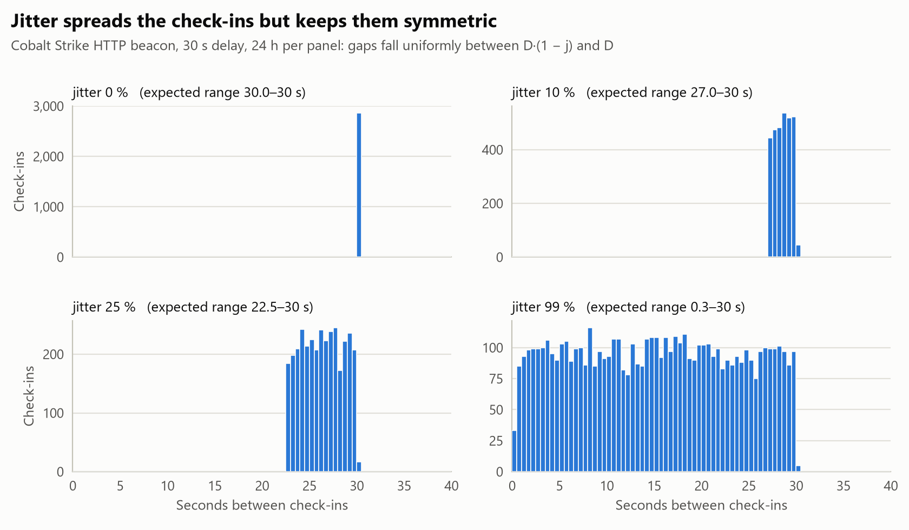
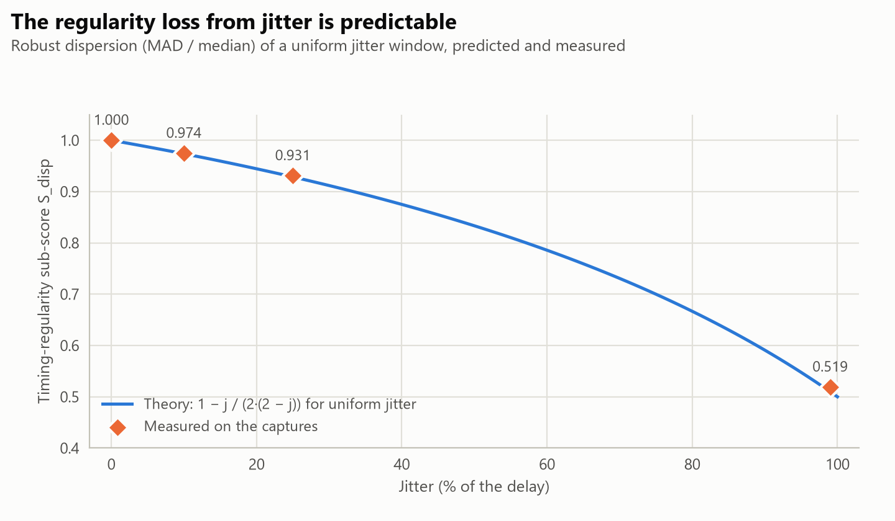
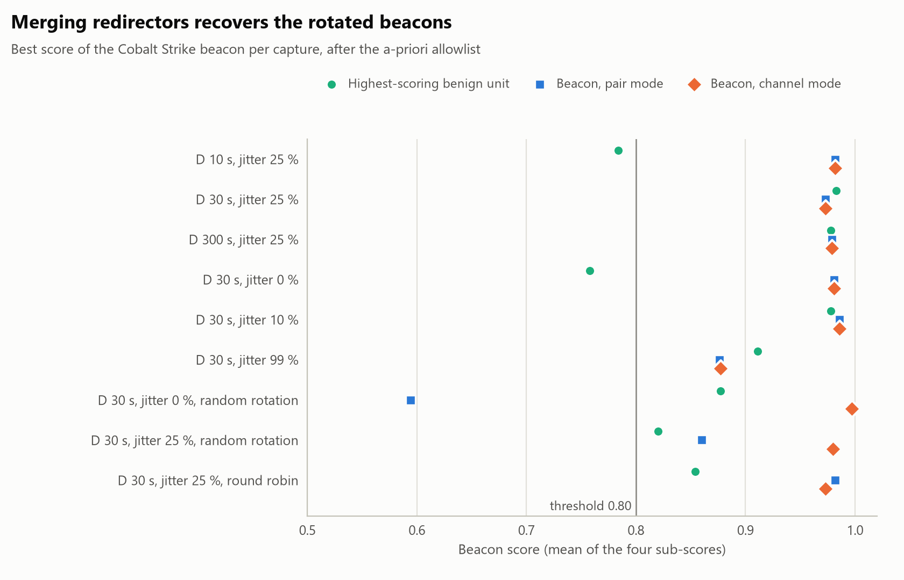

# Case 02 — C2 beaconing: finding Cobalt Strike by its rhythm, without reading a payload

| | |
|---|---|
| **Dataset** | Active Countermeasures, [*Malware of the Day — Understanding C2 Beacons, part 2*](https://www.activecountermeasures.com/malware-of-the-day-understanding-c2-beacons-part-2-of-2/): nine 24-hour lab captures (184 MB – 4.5 GB) and their nine 1-hour versions, each with one Cobalt Strike HTTP beacon of documented configuration inside ordinary Windows and Ubuntu traffic |
| **Scenario** | Windows host `192.168.2.77` checks in with a C2 server directly (`143.198.3.13`) or through two redirectors (`timeserversync[.]com`, `weathersync[.]cloud`) |
| **Question** | Can we find the C2 channel from connection timing and size alone, how early, and at what false-positive cost? |
| **Verdict** | **Beacon found in 9 of 9 captures** (channel mode), rank 1 in 7; **0 false positives** on held-out captures after triage |
| **MITRE ATT&CK** | T1071.001 Application Layer Protocol: Web Protocols · T1090.002 Proxy: External Proxy (redirectors) |
| **Tools** | Zeek 9.0.0 · Suricata 8.0.6 with ET Open · Python |
| **Detections produced** | [`beacon_score.py`](../../tools/beacon_score.py) (hunt, pair and channel modes) · [`beacon-hunting.kql`](../../detections/kql/beacon-hunting.kql) (Sentinel / Defender XDR) · [`cobalt-strike-profile.rules`](../../detections/suricata/cobalt-strike-profile.rules) (`sid:9100002`) |

## Summary

- **ET Open saw the delivery, not the channel.** Every capture produced 101,000–122,000 alerts a day. On the beacon's
  traffic it raised at most two hunting-level alerts about the PowerShell payload delivered at the start, and
  **nothing on the thousands of check-ins** that followed.
- **A detector that never reads payloads.** Four sub-scores computed from timestamps and byte counts only, so it works
  just as well when the channel is encrypted. Thresholds were fixed before the evaluation.
- **9 of 9 beacons found** in the 24-hour captures once destinations sharing a connection profile are merged into one
  channel (8 of 9 when every server is scored on its own). Rank 1 in 7 captures, 2 and 3 in the other two.
- **The false positives are real-world ones**: Windows and Office telemetry, Windows Update Delivery Optimization, a
  chat keep-alive. An allowlist learned on four captures removed **all** of them on the **five held-out captures**,
  with the beacon still ranked first.
- **Early and predictable.** In the official 1-hour captures the beacon is flagged in 8 of 9 configurations within the
  hour; the effect of jitter on the timing score matched a closed-form prediction to within 0.012.
- **From hunt to signature.** The profile found by the hunt became `sid:9100002`: one alert per host per hour on every
  beacon capture, none on the others.

## 1. The data and the ground truth

Each capture contains one beacon with a documented delay *D* and jitter *j* (the check-in interval is drawn between
*D·(1 − j)* and *D*), and in three of them the beacon alternates between two redirectors. The published figures give
an independent sanity check: with uniform jitter the mean interval is *D·(1 − j/2)*, which predicts the number of
check-ins in 24 hours.

| Capture | Delay | Jitter | Servers | Check-ins (24 h) | Expected *86,400 / (D·(1 − j/2))* | Median interval |
|---|---:|---:|---|---:|---:|---:|
| delay_var_d10_j25 | 10 s | 25 % | 1 | 9,821 | 9,874 | 8.80 s |
| delay_var_d30_j25 | 30 s | 25 % | 1 | 3,282 | 3,291 | 26.36 s |
| delay_var_d300_j25 | 300 s | 25 % | 1 | 346 | 329 | 260.30 s |
| jit_var_d30_j0 | 30 s | 0 % | 1 | 2,867 | 2,880 | 30.05 s |
| jit_var_d30_j10 | 30 s | 10 % | 1 | 3,024 | 3,032 | 28.60 s |
| jit_var_d30_j99 | 30 s | 99 % | 1 | 5,720 | 5,703 | 15.15 s |
| random_d30_j0 | 30 s | 0 % | 2, random | 2,917 | 2,880 | 30.32 s |
| random_d30_j25 | 30 s | 25 % | 2, random | 3,286 | 3,291 | 26.52 s |
| round_rob_d30_j25 | 30 s | 25 % | 2, alternating | 3,256 | 3,291 | 26.49 s |

**Ground truth** comes from content the detector never reads: the check-ins are HTTP requests with a fixed
`/image/<id>` URI and a spoofed Internet Explorer 8 user agent, visible in Zeek's `http.log`. Every
(client, server, port) pair that carries them is a positive; everything else is a negative, including the periodic
but benign services every network has. Every capture's SHA-256 matches the checksum published by the source; for
one file the published value is truncated and matches as a prefix (see [methodology](../../docs/methodology.md)).

## 2. Signature baseline: what ET Open saw

| Capture | ET Open alerts (24 h) | Alerts on the beacon's traffic | Which |
|---|---:|---:|---|
| delay_var_d10_j25 | 118,132 | 2 | ET HUNTING *Dotted Quad Host Base64-Encoded Powershell Payload* · *HTTP Response Containing Base64-Encoded Powershell Payload Keywords* |
| delay_var_d30_j25 | 103,427 | 2 | the same two hunting rules |
| delay_var_d300_j25 | 101,384 | 0 | — |
| jit_var_d30_j0 | 105,687 | 4 | the same two hunting rules |
| jit_var_d30_j10 | 106,184 | 2 | the same two hunting rules |
| jit_var_d30_j99 | 118,084 | 2 | the same two hunting rules |
| random_d30_j0 | 121,765 | 1 | *HTTP Response Containing Base64-Encoded Powershell Payload Keywords* |
| random_d30_j25 | 120,226 | 0 | — |
| round_rob_d30_j25 | 119,861 | 1 | *HTTP Response Containing Base64-Encoded Powershell Payload Keywords* |

About 85,600 of the daily alerts are `SURICATA Ethertype unknown` (a capture artefact), and 8,000–24,000 are
`ET INFO Windows Update P2P Activity`. The few alerts on the beacon's flow fire on the initial PowerShell payload
download. The check-ins themselves, thousands per day, look like ordinary web requests to a signature engine that has
no rule for this profile.

## 3. The detector

[`tools/beacon_score.py`](../../tools/beacon_score.py) reads Zeek's `conn.log` and scores every
(client, server, port, protocol) pair with at least 20 connections:

| Sub-score | Formula | What it captures |
|---|---|---|
| **S_disp** (timing regularity) | 1 − MAD(intervals) / median(intervals) | A beacon's intervals cluster around its delay |
| **S_skew** (timing symmetry) | 1 − \|Bowley skewness of the intervals\| | Jitter spreads intervals symmetrically; human or bursty traffic is skewed |
| **S_size** (size regularity) | 1 − MAD(bytes) / median(bytes) | Idle check-ins repeat the same request and response |
| **S_cov** (persistence) | Hours with traffic / hours in the capture | A beacon never sleeps |

The score is the mean of the four; a unit is flagged at **score ≥ 0.80**. Both the threshold and the 20-connection
minimum were fixed before any capture was scored. The detector uses **robust statistics** (median, MAD, quartiles)
throughout, so a few outliers, such as a check-in delayed by a busy host, cannot move the result.

**Two modes.**

- **Pair mode** scores each server separately. This is the classic approach.
- **Channel mode** first merges the servers that one client reaches on the same port with the same connection size
  (median within 3 %), and scores the merged timeline. When a channel is split across several servers, each server
  on its own sees an irregular subset of the check-ins; the merged view recovers the channel's real rhythm.

### 3.1 What jitter does to the timing score

<picture>
  <source media="(prefers-color-scheme: dark)" srcset="figures/beacon_gap_histograms_dark.png">
  
</picture>

Jitter spreads the intervals **uniformly** between *D·(1 − j)* and *D*. A uniform distribution is symmetric, so
S_skew stays high at any jitter; only the dispersion grows. For a uniform window the robust dispersion has a closed
form, which predicts the timing sub-score before looking at data:

*MAD / median = j / (2 · (2 − j))*, so *S_disp = 1 − j / (2 · (2 − j))*

<picture>
  <source media="(prefers-color-scheme: dark)" srcset="figures/beacon_dispersion_theory_dark.png">
  
</picture>

| Jitter | Predicted S_disp | Measured S_disp |
|---:|---:|---:|
| 0 % | 1.000 | 1.000 |
| 10 % | 0.974 | 0.974 |
| 25 % | 0.929 | 0.931 |
| 99 % | 0.507 | 0.519 |

Even at 99 % jitter the other three sub-scores stay close to 1, so the total (0.876) remains above the threshold. That
is by design: a detector that relied on timing dispersion alone would lose this beacon.

## 4. Results

### 4.1 24-hour captures

Scope fixed before the evaluation: outbound traffic only (private client to public server), NTP excluded, and
servers whose DNS name is an operating-system connectivity check or time service excluded (see
[methodology](../../docs/methodology.md#5-allowlists)).

| Capture | Pair mode: beacon rank · score | Channel mode: beacon rank · score | False positives (pair / channel) |
|---|---|---|---|
| D 10 s, jitter 25 % | 1 · 0.982 | 1 · 0.982 | 0 / 0 |
| D 30 s, jitter 25 % | 1 · 0.973 | 2 · 0.973 | 7 / 10 |
| D 300 s, jitter 25 % | 1 · 0.979 | 1 · 0.979 | 2 / 2 |
| D 30 s, jitter 0 % | 1 · 0.981 | 1 · 0.981 | 0 / 0 |
| D 30 s, jitter 10 % | 1 · 0.986 | 1 · 0.986 | 0 / 3 |
| D 30 s, jitter 99 % | 3 · 0.876 | 3 · 0.877 | 2 / 3 |
| D 30 s, jitter 0 %, random rotation | 12 · 0.594 (**missed**) | 1 · 0.997 | 1 / 2 |
| D 30 s, jitter 25 %, random rotation | 1 · 0.860 (one of two servers) | 1 · 0.980 | 1 / 2 |
| D 30 s, jitter 25 %, round robin | 1 and 2 · 0.982 / 0.978 | 1 · 0.973 | 1 / 2 |
| **Total** | **8 of 9 detected** | **9 of 9 detected** | **14 / 24 in 216 h** |

<picture>
  <source media="(prefers-color-scheme: dark)" srcset="figures/beacon_scores_dark.png">
  
</picture>

Without the scope step the detector flags 48 benign pairs in pair mode: Windows Update peer-to-peer traffic between
lab hosts (14), NTP (9), Ubuntu's connectivity and changelog checks (11) and the Microsoft services listed below (14).
Channel mode flags 56. With the scope step, 14 and 24 remain over nine days of traffic, that is 1.6 and 2.7 a day.

### 4.2 What the false positives were

| Service | Why it looks like a beacon |
|---|---|
| Windows Update Delivery Optimization (`*.prod.do.dsp.mp.microsoft.com`) | Polls its coordination service every ~17–32 minutes |
| Office configuration (`ecs.office.com`) | Fetches experiment and configuration settings every 5 minutes or every hour |
| Windows and Office telemetry (`*.events.data.microsoft.com`, `settings-win.data.microsoft.com`) | Uploads batches on a timer |
| Edge, Skype and MSN configuration endpoints | Periodic configuration refresh |
| Slack (`app.slack.com`) | Keep-alive connections |
| Windows Update certificate lists (`ctldl.windowsupdate.com`) | Scheduled download |

These are genuine periodic services. They are the reason every beacon hunt ends with a triage step.

### 4.3 Triage, measured out of sample

In production, the benign services a hunt flags are triaged and allowlisted. Allowlisting whatever turned up and
then reporting zero false positives on the same captures would be circular, so the step was measured on held-out
data. The allowlist was learned from the false positives of four *training* captures, using exact DNS names only,
and applied unchanged to the other five:

| Held-out capture | Channel mode: FP before → after | Beacon rank after | Pair mode: FP before → after | Beacon rank after |
|---|---|---:|---|---:|
| D 30 s, jitter 10 % | 3 → **0** | 1 | 0 → **0** | 1 |
| D 30 s, jitter 99 % | 3 → **0** | 1 | 2 → **0** | 1 |
| D 30 s, jitter 0 %, random rotation | 2 → **0** | 1 | 1 → **0** | 9 (missed) |
| D 30 s, jitter 25 %, random rotation | 2 → **0** | 1 | 1 → **0** | 1 |
| D 30 s, jitter 25 %, round robin | 2 → **0** | 1 | 1 → **0** | 1 |

The channel-mode allowlist has 30 names, all Microsoft, Slack and certificate-authority services; the pair-mode one
has 3. Results are in [`results/beaconing/`](../../results/beaconing/).

### 4.4 Early detection: the official 1-hour captures

The source also publishes the first hour of each capture. Processed with Zeek 9.0.0 in this lab:

| Capture (1 h) | Pair mode | Channel mode | False positives |
|---|---|---|---:|
| D 10 s, jitter 25 % | rank 1 · 0.949 | rank 1 · 0.949 | 0 |
| D 30 s, jitter 25 % | rank 1 · 0.964 | rank 1 · 0.964 | 1 |
| D 300 s, jitter 25 % | not scored: 16 check-ins, below the 20-connection minimum | same | 0 |
| D 30 s, jitter 0 % | rank 1 · 0.991 | rank 1 · 0.991 | 0 |
| D 30 s, jitter 10 % | rank 1 · 0.976 | rank 1 · 0.976 | 0 |
| D 30 s, jitter 99 % | rank 1 · 0.870 | rank 1 · 0.872 | 0 |
| D 30 s, jitter 0 %, random rotation | ranks 1–2 · 0.875 | rank 1 · 0.996 | 0 |
| D 30 s, jitter 25 %, random rotation | ranks 1–2 · 0.889 | rank 1 · 0.929 | 0 |
| D 30 s, jitter 25 %, round robin | ranks 1–2 · 0.958 | rank 1 · 0.958 | 0 |

A beacon that checks in every few seconds or minutes is visible within its first hour. A 5-minute beacon needs a
longer window: the 20-connection minimum is a deliberate floor against scoring noise.

In pair mode, the rotated beacons score above the threshold in one hour but not over 24 hours: the per-server view
of a rotated channel is unstable. Channel mode is stable in both (0.93–1.00).

### 4.5 Consistency with this lab's own processing

The 24-hour results above use the Zeek logs published with the captures. The same captures were processed with
Zeek 9.0.0 in this lab and scored again: beacon scores agree to within ±0.03, and the detection outcome of every
capture is the same in both modes ([`results/beaconing_own_zeek/`](../../results/beaconing_own_zeek/)).

## 5. From hunt to signature

Once the hunt has found a channel, its fixed features can become a signature that finds the same implant profile on
every other host at almost no cost. [`cobalt-strike-profile.rules`](../../detections/suricata/cobalt-strike-profile.rules)
(`sid:9100002`) matches the check-in URI pattern together with the spoofed user agent, at most once per host per hour:

| Capture | HTTP transactions | Alerts |
|---|---:|---:|
| delay_var_d10_j25 (1 h) | 677 | 1 |
| delay_var_d30_j25 (1 h) | 432 | 1 |
| delay_var_d300_j25 (1 h) | 280 | 1 |
| jit_var_d30_j0 (1 h) | 382 | 1 |
| jit_var_d30_j10 (1 h) | 392 | 1 |
| jit_var_d30_j99 (1 h) | 497 | 1 |
| random_d30_j0 (1 h) | 386 | 1 |
| random_d30_j25 (1 h) | 419 | 1 |
| round_rob_d30_j25 (1 h) | 403 | 1 |
| dnscat2 tunnel, case 01 (1 h) | 12 | 0 |
| dnscat2 tunnel, case 01 (24 h) | 446 | 0 |

It also catches the 5-minute beacon within the hour, which the behavioural hunt cannot score yet.

The two approaches complement each other. The behavioural hunt finds channels nobody has a rule for; the signature
then finds the same profile cheaply, in real time and on hosts where the hunt has not run yet.

## 6. Limitations and production tuning

- **Benign periodicity is the main cost.** Telemetry, update and chat services are regular by design. Expect a larger
  first-pass allowlist in an enterprise; key it on exact DNS names and review it, because an allowlist is also a
  place to hide.
- **Merging has a price.** Channel mode found every beacon but raised more candidates (24 against 14). A practical
  workflow runs pair mode for alerting and channel mode as a daily hunt.
- **Slow beacons need longer windows.** A check-in every few hours stays under the 20-connection minimum for a day or
  more; run the same scoring over a week of logs for those.
- **No byte counts in endpoint telemetry.** Defender for Endpoint's `DeviceNetworkEvents` has no sizes, so the KQL
  version for Defender XDR uses three sub-scores, and identifies the process behind each connection in exchange.
- **One framework.** The evaluation covers Cobalt Strike HTTP beacons. The features are protocol-agnostic
  (timestamps and sizes) and apply unchanged to HTTPS or other frameworks, but they have only been measured here.

## 7. Response

1. **Contain.** Block the C2 server and both redirectors (IPs and domains) at the firewall or web proxy, and isolate
   `192.168.2.77` through the EDR, keeping the EDR channel open.
2. **Scope.** Run the KQL hunt across all hosts for the last 30 days and deploy `sid:9100002` fleet-wide: other hosts
   with the same profile are other implants.
3. **Identify the implant.** Only the endpoint can name the process behind the connections (the Defender XDR query
   returns it). Beacons of this kind usually live in memory, so collect a memory image before rebooting.
4. **Eradicate and recover.** Reimage the host, rotate credentials used on it, and review what the attacker could
   reach from it during the dwell time.
5. **Improve.** Keep the beacon hunt as a scheduled job, maintain its triage allowlist, and route web traffic through
   a proxy so that raw-IP HTTP (the `143.198.3.13` case) is blocked by policy.

## 8. Hunting queries for Microsoft Sentinel and Defender XDR

[`detections/kql/beacon-hunting.kql`](../../detections/kql/beacon-hunting.kql) implements the same score:

- **Sentinel over Zeek `conn` logs** (custom table, deployed in [case 03](../03-soc-lab-firewall-edr-siem/)): all four
  sub-scores, outbound pairs only, NTP excluded.
- **Defender XDR over `DeviceNetworkEvents`**: three sub-scores (no byte counts in the table), grouped by device,
  remote address, port and initiating process.

## 9. Indicators (defanged)

| Type | Value | Note |
|---|---|---|
| IP | `143.198.3.13` | C2 server contacted directly (Host header = IP or `timeserversync[.]com`) |
| IP | `143.198.73.116` | Redirector, `timeserversync[.]com` |
| IP | `24.199.110.233` | Redirector, `weathersync[.]cloud` |
| URI pattern | `/image/<30+ letters a–p>-.jpg` | Check-in request |
| User agent | `Mozilla/5.0 (compatible; MSIE 8.0; Windows NT 6.1; Trident/5.0)` | Spoofed Internet Explorer 8 |
| Host | `192.168.2.77` | Beaconing workstation |

## 10. Reproduce

```powershell
.\.venv\Scripts\python.exe lab\fetch_published_zeek_logs.py                 # verified published logs
.\.venv\Scripts\python.exe tools\evaluate_beacons.py _private\zeek_published --out results\beaconing
.\.venv\Scripts\python.exe tools\beacon_triage_split.py _private\zeek_published --mode channel
.\lab\process_beacon_1h.ps1                                                  # official 1-hour captures
.\.venv\Scripts\python.exe tools\evaluate_beacons.py _private\zeek --only "_1h$" --out results\beaconing_1h
.\lab\process_beacon_datasets.ps1                                            # 24-hour captures, ET Open
.\.venv\Scripts\python.exe tools\suricata_summary.py
```

## 11. MITRE ATT&CK mapping

| Tactic | Technique | Evidence in this case |
|---|---|---|
| Command and Control | T1071.001 Application Layer Protocol: Web Protocols | Periodic HTTP check-ins from `192.168.2.77` |
| Command and Control | T1090.002 Proxy: External Proxy | Two redirectors in front of the C2 server in three captures |
