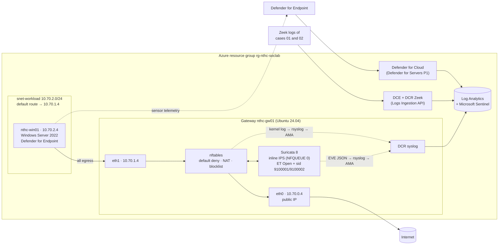

# Case 03 — SOC lab: firewall, inline IPS, EDR and SIEM, end to end

| | |
|---|---|
| **Environment** | Microsoft Azure, deployed from code ([`lab/case03/`](../../lab/case03/)): Bicep template, cloud-init, PowerShell orchestration |
| **Components** | Linux gateway with an **nftables** firewall and **Suricata 8 inline (IPS, NFQUEUE)** · Windows Server 2022 endpoint with **Microsoft Defender for Endpoint** (Defender for Servers Plan 1) · **Microsoft Sentinel** on Log Analytics |
| **Question** | Does a detection travel from the wire and the endpoint all the way to a SIEM incident, and does the response hold? |
| **Detection content** | 4 Sentinel analytics rules as code ([`detections/kql/sentinel-rules/`](../../detections/kql/sentinel-rules/)), custom Zeek tables fed with the case 01 and 02 data, an asset watchlist, the custom Suricata rules of cases 01 and 02 on the IPS |
| **Status** | Infrastructure and detection content complete and validated offline (section 8). The cloud run is performed with [`deploy.ps1`](../../lab/case03/deploy.ps1), which writes its evidence to `results/case03/` |

## 1. Architecture



| Subnet | Range | Contents | Routing |
|---|---|---|---|
| `snet-external` | 10.70.0.0/24 | Gateway `eth0` (public IP) | Azure default |
| `snet-internal` | 10.70.1.0/24 | Gateway `eth1` 10.70.1.4, IP forwarding on | Azure default |
| `snet-workload` | 10.70.2.0/24 | Windows endpoint 10.70.2.4, no public IP | `0.0.0.0/0` → 10.70.1.4 (the gateway) |

No virtual machine accepts inbound connections from the internet. Both are managed through Azure `run-command`,
which uses the platform agent and needs neither RDP nor SSH exposure.

## 2. Components and design decisions

| Component | Choice | Why |
|---|---|---|
| Firewall | nftables on Ubuntu 24.04: default-deny input and forward, source NAT for the lab, a `blocklist` set for response | Free, fully scriptable, and every rule is readable in [`gateway-cloud-init.yaml`](../../lab/case03/gateway-cloud-init.yaml) |
| IPS | Suricata 8 **inline**: nftables queues the lab's traffic to NFQUEUE 0 and Suricata returns the verdict | The same engine as cases 01 and 02, now in the traffic path. `queue … bypass` means a stopped Suricata degrades to a plain firewall instead of cutting the lab off |
| IPS rules | ET Open plus `sid:9100001` (DNS tunnel, case 01) and `sid:9100002` (Cobalt Strike profile, case 02) | Detections developed offline, deployed where they would run in production |
| EDR | Defender for Endpoint through Defender for Servers Plan 1 (30-day trial) | Servers need a server licence for Defender for Endpoint; the plan provides it and onboards Azure VMs automatically |
| Log shipping | Azure Monitor Agent with a syslog data collection rule (facilities `kern`, `local5`, `auth`, `daemon`) | Suricata's EVE JSON is read by rsyslog (facility `local5`); nftables logs arrive as kernel messages |
| Offline data | Custom tables `ZeekDns_CL` and `ZeekConn_CL` fed through the Logs Ingestion API | The case 01 and 02 Zeek logs become SIEM data, so their KQL detections run on the real records |
| Asset context | Watchlist `LabAssets` (IP address → host name) | Correlating a network alert (an IP) with an endpoint alert (a host name) needs an asset inventory, as in any SOC |
| Cost control | Auto-shutdown at 23:00 for both VMs, [`destroy.ps1`](../../lab/case03/destroy.ps1) deletes everything and returns Defender for Servers to the free tier | About 3–4 USD a day while running, within the free-account credit |

## 3. Data flowing into Sentinel

| Source | Path | Table |
|---|---|---|
| Suricata alerts, DNS, HTTP and TLS events | EVE JSON → rsyslog `imfile` (facility `local5`) → Azure Monitor Agent | `Syslog` |
| nftables drops and blocklist hits | Kernel log (`NTHC-BLOCK`, `NTHC-FWD-DROP`) → rsyslog → Azure Monitor Agent | `Syslog` |
| Defender for Endpoint and Defender for Cloud alerts | Defender for Cloud data connector | `SecurityAlert` |
| Zeek DNS logs, case 01 tunnel (173,860 records) and case 02 normal traffic (58,692) | [`ingest_zeek.py`](../../lab/case03/ingest_zeek.py) → Logs Ingestion API | `ZeekDns_CL` |
| Zeek connection logs, case 02 capture with the 99 %-jitter beacon (65,611 records) | [`ingest_zeek.py`](../../lab/case03/ingest_zeek.py) → Logs Ingestion API | `ZeekConn_CL` |

The Zeek records keep their relative timing and are shifted by one constant offset so that they land in the rules'
look-back window; the original timestamp is kept in `ts_original`.

## 4. Detection content

| Rule | Logic | Source | Cadence | Entities |
|---|---|---|---|---|
| [NTHC 01 — Suricata IPS alert on the lab gateway](../../detections/kql/sentinel-rules/01-suricata-ips-alert.kql) | Suricata alert of severity 1–2 from the lab network | `Syslog` | 5 min over 1 h | Source and destination IP |
| [NTHC 02 — DNS tunnel pattern](../../detections/kql/sentinel-rules/02-dns-tunnel-zeek.kql) | Case 01 logic: ≥ 50 unique subdomains per client, domain and hour, mean length ≥ 20, entropy ≥ 3.0 | `ZeekDns_CL` | 5 min over 1 day | Client IP, domain |
| [NTHC 03 — C2 beaconing](../../detections/kql/sentinel-rules/03-c2-beaconing-zeek.kql) | Case 02 score (pair mode): ≥ 20 connections, score ≥ 0.80, outbound, NTP excluded | `ZeekConn_CL` | 5 min over 1 day | Client and server IP |
| [NTHC 04 — Network and endpoint alerts on the same host](../../detections/kql/sentinel-rules/04-network-and-endpoint-correlation.kql) | A Suricata alert and a Defender alert for the same host within one hour, joined through `LabAssets` | `Syslog`, `SecurityAlert`, watchlist | 5 min over 2 h | Host, IP |

Every rule creates incidents and groups alerts that share the same entities, so one noisy host yields one incident
rather than dozens. In production, rules 02 and 03 would run hourly; the lab runs them every five minutes so that
the whole exercise fits in one sitting.

## 5. Scenario

[`scenario-endpoint.ps1`](../../lab/case03/scenario-endpoint.ps1) runs on the Windows endpoint and produces three
harmless, vendor-provided test signals, each visible at a different layer:

| # | Signal | Layer that should see it | Expected evidence |
|---|---|---|---|
| 1 | Plain-HTTP request to the standard IDS test page `testmynids.org/uid/index.html` | Network: Suricata on the gateway | ET Open *GPL ATTACK_RESPONSE id check returned root* in `Syslog` → rule NTHC 01 |
| 2 | Microsoft's documented Defender for Endpoint detection test (a command line the sensor is built to flag) | Endpoint: Defender for Endpoint | Defender alert in `SecurityAlert` |
| 3 | Download of the EICAR anti-malware test file over HTTPS | Endpoint only (TLS hides it from the IPS) | Defender quarantine and alert |

Signals 1 and 2 on the same host within an hour trigger rule NTHC 04, the network-to-endpoint correlation. Signal 3
shows the complementary blind spot: encrypted traffic the network cannot read but the endpoint can.

Rules NTHC 02 and 03 fire on the uploaded case 01 and 02 data, which validates the KQL versions of those detections
against the records they were designed on.

## 6. Response

| Step | Action | Where | Verification |
|---|---|---|---|
| Contain the destination | Add the test page's IP addresses to the nftables `blocklist` set | Gateway (`deploy.ps1` step 7) | The same request from the endpoint now fails, and `NTHC-BLOCK` kernel log lines reach `Syslog` |
| Contain the host | *Isolate device* in the Defender portal, which keeps the Defender channel open while cutting everything else | Defender for Endpoint | Device shows *Isolated*; the isolation action appears in the device timeline |
| Scope | Run the case 01 and 02 hunting queries across the workspace | Sentinel | See [`dns-tunnel-hunting.kql`](../../detections/kql/dns-tunnel-hunting.kql) and [`beacon-hunting.kql`](../../detections/kql/beacon-hunting.kql) |
| Close | Document the incident, lift the block and the isolation, remove the lab | Sentinel, [`destroy.ps1`](../../lab/case03/destroy.ps1) | Resource group deleted, Defender for Servers back to free |

## 7. Run it

Requirements: an Azure subscription (a free account is enough), Azure CLI, Python with this repository's
`requirements.txt`, and the Zeek logs of cases 01 and 02 under `_private/` (see [lab setup](../../docs/lab-setup.md)).

```powershell
az login
.\lab\case03\deploy.ps1                      # about 60–90 minutes, most of it waiting for agents and alerts
.\lab\case03\destroy.ps1                     # removes everything
```

`deploy.ps1` stops at the first failure and prints the step. Secrets (the Windows password and the gateway's SSH key)
are generated locally, stored as `lab/case03/*.local*` and never committed.

## 8. Validation performed offline

| Check | Result |
|---|---|
| Bicep template compiled with Bicep CLI 0.47.16 | 28 resources, 9 parameters, 8 outputs, no warnings |
| Rendered cloud-init parsed as YAML, rules decoded from base64 | 8 files, 16 commands; both custom rules present; 13.9 KB of custom data (limit 87 KB) |
| Gateway software stack rebuilt in an Ubuntu 24.04 container | Suricata 8.0.7 from the OISF repository; ET Open plus the two custom rules merged by `suricata-update`; the configured `suricata.yaml` passes `suricata -T` |
| nftables ruleset | `nft -c` syntax check passes |
| Zeek uploads, dry run | 173,860 + 58,692 DNS records in 85 + 29 calls, 65,611 connection records in 31 calls |
| PowerShell and Python | Every script parses and compiles |

## 9. MITRE ATT&CK and D3FEND

| Framework | Item | Where in the lab |
|---|---|---|
| ATT&CK | T1071.001 Web Protocols, T1071.004 DNS, T1572 Protocol Tunneling | Rules NTHC 02 and 03, IPS rules 9100001 and 9100002 |
| D3FEND | Network Traffic Filtering | nftables default-deny and blocklist |
| D3FEND | Network Traffic Signature Analysis | Suricata inline with ET Open and custom rules |
| D3FEND | Network Isolation | Blocklist and Defender *Isolate device* |
